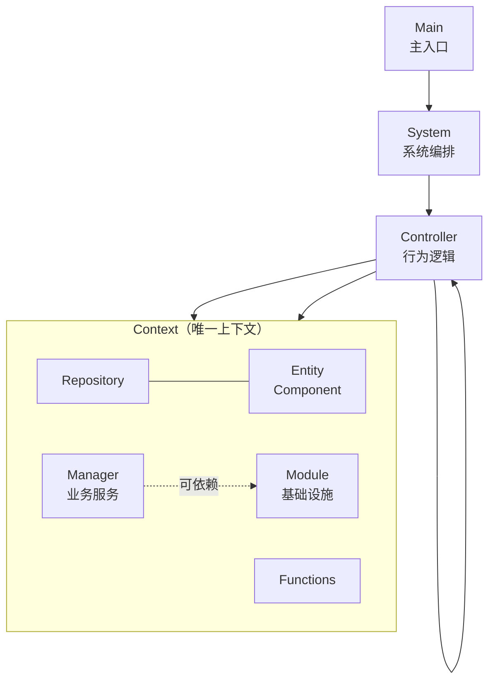

# 架构规范

## 理念
- KISS
- 代码只`定义数据类型`、`读取`和`使用`数据，不`定义数据内容`
- `控制逻辑`与`行为逻辑`分离
- 非单机：`逻辑处理`与`表现处理`分离
- `运行时`与`编辑时`分离
- 调用与依赖关系单向，低层调高层只能通过接口或委托

## 层级图

## 控制与行为
- **Main**：全局唯一主入口，启动引导、创建上下文、进入主循环
- **System**：系统级编排，调用Controller；必有对应`SystemState`和`SystemEvents`
- **Controller**：无状态静态类，负责控制逻辑（Spawn/Unspawn/Tick）
- **Controller**：无状态静态类，负责行为逻辑，只处理单一类型Entity；业务不复杂时可省略

### 主循环
`Init` -> `ProcessInput` -> `Tick` -> `Render` -> `TearDown`

| 阶段 | 职责 |
|---|---|
| Init | 创建上下文、处理依赖、加载资源、注册事件 |
| ProcessInput | 人机交互、网络通信、系统事件 |
| Tick | PreTick -> FixTick（手动步进与物理模拟）-> LateTick |
| Render | 引擎自动处理，除非有特殊需求 |
| TearDown | 卸载资源、注销事件、销毁上下文 |

## 上下文
- **Context**：唯一上下文，存放所有Repository、Module、全局唯一Entity
- **Repository**：实体仓库，以UniqueID为Key存查实体，提供Add/TryGet/Remove接口
- **Entity**：核心数据载体，Component是其字段封装
  - 必有`UniqueID`（实例间不重复）
  - 必有`TypeID`（标识类型，同类相同）
  - 非单机时必有`Render`与`Logic`两个子类型
- **Module**：基础设施能力，如资源、输入、网络等
- **Manager**：业务功能服务，如音效、特效、本地化等。层级高于Module，必要时可依赖Module，非必要时不依赖
- **Functions**：缓动函数、JSON序列化、二进制序列化等工具函数集

## 程序集划分
- **Launcher（启动层）**：AOT编译，负责引导启动、下载热更DLL、加载资源目录
- **HotReload（热更层）**：核心游戏逻辑，运行时可热更新
- **Common（公共层）**：跨模块共享的工具与类型定义，不含业务逻辑
- **Editor（编辑层）**：仅编辑时使用，不参与运行时构建
- **Tests（测试层）**：单元测试与集成测试
- **Sample（示例层）**：示例代码与演示场景
